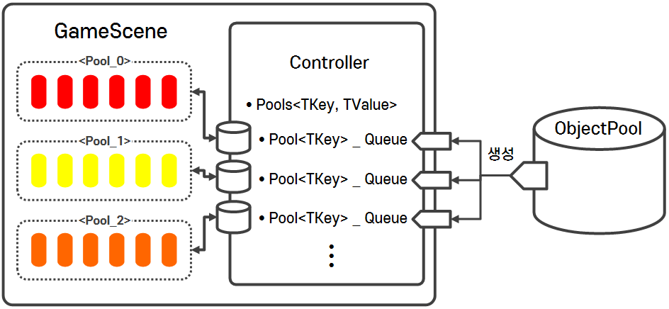

# ObjectPoolSystem

#### ⦁ [ObjectPoolSystem]은 씬에 배치된 수 많은 오브젝트들을 특정 '키워드'로 묶어 오브젝트를 Pooling 후 관리하는 시스템입니다.

#### ⦁ Version 1.0 (2023.09.02)

### 1. 데모 이미지

    

### 2. 조건

- [Object Pool]은 특정 오브젝트의 형식에 국한되지 않고 다양하게 관리할 수 있을 것

- 데이터 구조와 같이 Object Pool이 필요한 어디서든지 사용할 수 있어야 할 것

### 3. 메인 설계

- **Object Pool 설계**

  - [Object Pool]은 다양한 타입의 컴포넌트를 담을 수 있어야하기 때문에 제네릭(Generic)하게 구성

  - [Object Pool]은 용량(Capacity)을 무조건 설정해야 생성 가능하도록 구성

  - 선입선출 구조의 큐(Queue) 자료구조를 사용하여 구현 (최대한 단순한 구조의 자료구조를 사용)

  - **[ObjectPool](https://github.com/MinjunISAAC/ObjectPoolSystem/blob/main/ObjectPoolSystem/Assets/Utility/ObjectPoolSystem/Scripts/ObjectPool.cs)**

    

- **기타**
  - **데모 씬 구조 설명**

    1) **[Npc Controller]** 에 의해서 필요한 Npc 오브젝트의 **[Object Pool] 생성 (Capacity 필요)**

    2) **[Npc Trigger]** 와 **[Unit]의 충돌을 감지** 후, Trigger에 맞는 Npc 오브젝트를 **[Object Pool]에서 전달 받아 활성화(Get) **
 
        오브젝트가 필요없을 경우 **[Object Pool]에게 반납 후 비활성화(Return)**

    3) 만약 **Capacity가 초과할 경우 새롭게 생성 후 [Object Pool]의 크기를 늘려줌**
     
  - **Npc Group**

    - **[NpcController](https://github.com/MinjunISAAC/ObjectPoolSystem/blob/main/ObjectPoolSystem/Assets/TestGame/Scripts/Npc/NpcController.cs)**
 
    - **[NpcTrigger](https://github.com/MinjunISAAC/ObjectPoolSystem/blob/main/ObjectPoolSystem/Assets/TestGame/Scripts/Npc/NpcTrigger.cs)**
 
    - **[Npc](https://github.com/MinjunISAAC/ObjectPoolSystem/blob/main/ObjectPoolSystem/Assets/TestGame/Scripts/Npc/Npc.cs)**

  - **Unit Group**

    - **[UnitController](https://github.com/MinjunISAAC/ObjectPoolSystem/blob/main/ObjectPoolSystem/Assets/TestGame/Scripts/Unit/Manage/UnitController.cs)**
 
    - **[Unit](https://github.com/MinjunISAAC/ObjectPoolSystem/blob/main/ObjectPoolSystem/Assets/TestGame/Scripts/Unit/Unit.cs)** 
